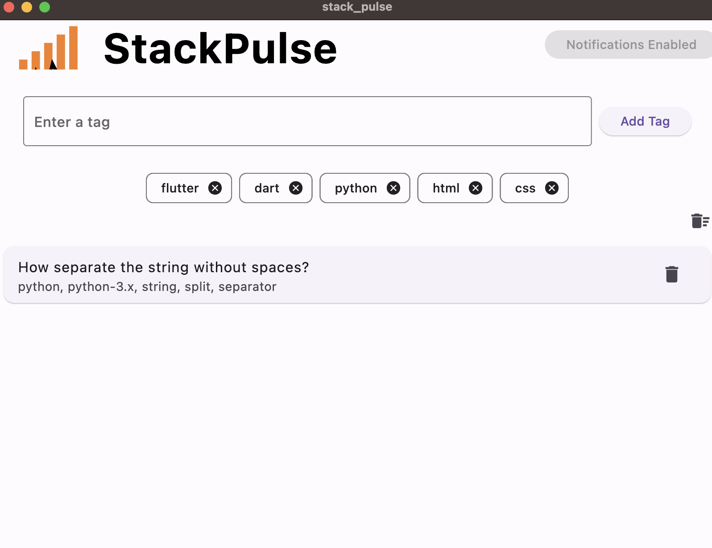

# StackPulse


StackPulse is a Flutter application that notifies users about new Stack Overflow questions for specified tags in real-time. Stay updated with the latest questions on Stack Overflow that matter to you!

## Features

- Real-time notifications for new Stack Overflow questions.
- Add and manage tags to track specific topics.
- View question details and tags.
- Enable or disable notifications.
- Dismiss individual notifications.
- Clear all notifications with a single click.

## Installation

### Android

1. Download the APK from the [releases page](https://github.com/mendelg/stackpulse/releases).
2. Open the APK file on your Android device and follow the installation instructions.

### macOS

1. Download the DMG file from the [releases page](https://github.com/mendelg/stackpulse/releases).
2. Open the DMG file and drag the StackPulse app to your Applications folder.


## Usage

- **Add a Tag**: Enter a tag in the input field and click "Add Tag".
- **Remove a Tag**: Click the 'trash' icon button on a tag to remove it.
- **Clear Notifications**: Click the trash icon to clear all notifications.
- **View Question**: Click on a notification to view the question on Stack Overflow.
- **Dismiss Notification**: Swipe left or right on a notification to dismiss it.

## Screenshots

### Main Screen



## Contributing

Contributions are welcome! Please fork this repository and submit a pull request for any enhancements or bug fixes.

## License

This project is licensed under the MIT License - see the [LICENSE](https://github.com/mendelg/stackpulse/blob/main/LICENSE) file for details.

## Credits

- [Flutter](https://flutter.dev/)
- [Stack Exchange API](https://api.stackexchange.com/)

## Building the App

### Android (APK)

1. **Build the APK**: Run the following command in your project directory:

    ```sh
    flutter build apk --release
    ```

2. **Locate the APK**: The generated APK will be located at `build/app/outputs/flutter-apk/app-release.apk`.

### Android (AAB)

1. **Build the AAB**: Run the following command in your project directory:

    ```sh
    flutter build appbundle --release
    ```

2. **Locate the AAB**: The generated AAB will be located at `build/app/outputs/bundle/release/app-release.aab`.

### macOS (DMG)

1. **Build the macOS app**: Run the following command in your project directory:

    ```sh
    flutter build macos --release
    ```

2. **Locate the App**: The generated app will be located at `build/macos/Build/Products/Release/YourApp.app`.

3. **Create DMG**: Use a tool like `create-dmg` to create a DMG from the `.app` file:

    ```sh
    npm install -g create-dmg
    create-dmg 'build/macos/Build/Products/Release/YourApp.app' 'build/macos/Build/Products/Release/'
    ```


### Web

1. **Build the Web app**: Run the following command in your project directory:

    ```sh
    flutter build web --release
    ```

2. **Locate the Web Files**: The generated web files will be located at `build/web`.

